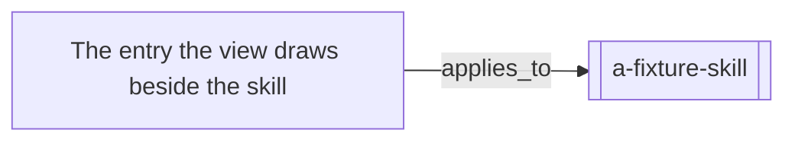

# A view invented for a fixture

It is drawn from records it no longer agrees with.

<!-- generated by tools/build-views.mjs: everything below is derived from the records -->

## What is in this view

### Skills

- [a-fixture-skill](../skills/a-fixture-skill/SKILL.md), `skill:a-fixture-skill`

### Knowledge

- [The entry the view draws beside the skill](../knowledge/a-fixture-entry.md), `knowledge:a-fixture-entry`
