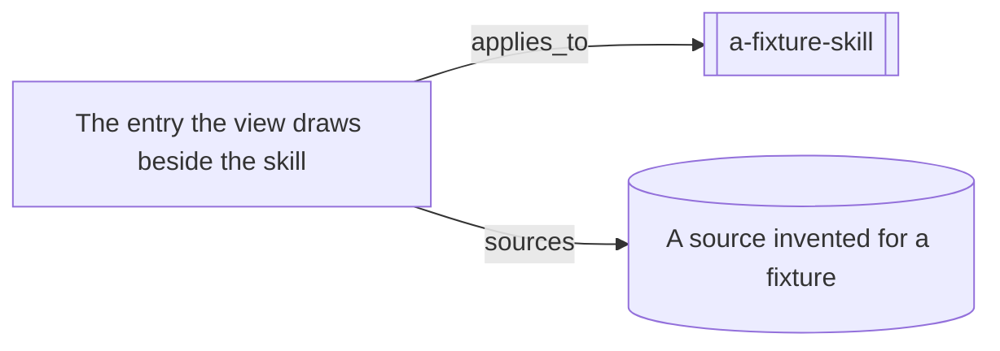

# A view invented for a fixture

Its edge filter names one label without writing it as a list, so nothing that
reads the filter sees a list at all. The diagram below is what this tree
generates with no filter applied: it walks the `sources` edge the author did
not ask for, which is the defect, and it is committed that way so the only
finding is the one about the filter.

<!-- generated by tools/build-views.mjs: everything below is derived from the records -->

## What is in this view

### Skills

- [a-fixture-skill](../skills/a-fixture-skill/SKILL.md), `skill:a-fixture-skill`

### Knowledge

- [The entry the view draws beside the skill](../knowledge/a-fixture-entry.md), `knowledge:a-fixture-entry`

### Evidence

- [A source invented for a fixture](../evidence/example-reading.md), `evidence:example-reading`
