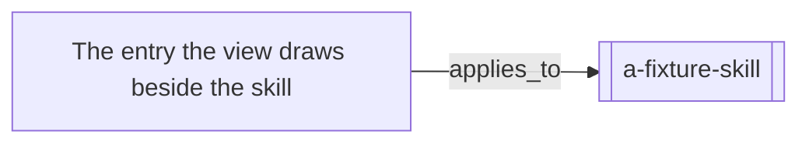

# A view invented for a fixture

Its edge filter is written the way LAYOUT.md shows, inline and with a comment
after it, and one of the two labels is misspelled. The finding names the
misspelled one *by its position in the list*, which is only possible if the
inline form was read as a list at all.

The diagram below draws two entries, not three: the filter was applied, so the
`sources` edge to the evidence record was not walked.

<!-- generated by tools/build-views.mjs: everything below is derived from the records -->

## What is in this view

### Skills

- [a-fixture-skill](../skills/a-fixture-skill/SKILL.md), `skill:a-fixture-skill`

### Knowledge

- [The entry the view draws beside the skill](../knowledge/a-fixture-entry.md), `knowledge:a-fixture-entry`
