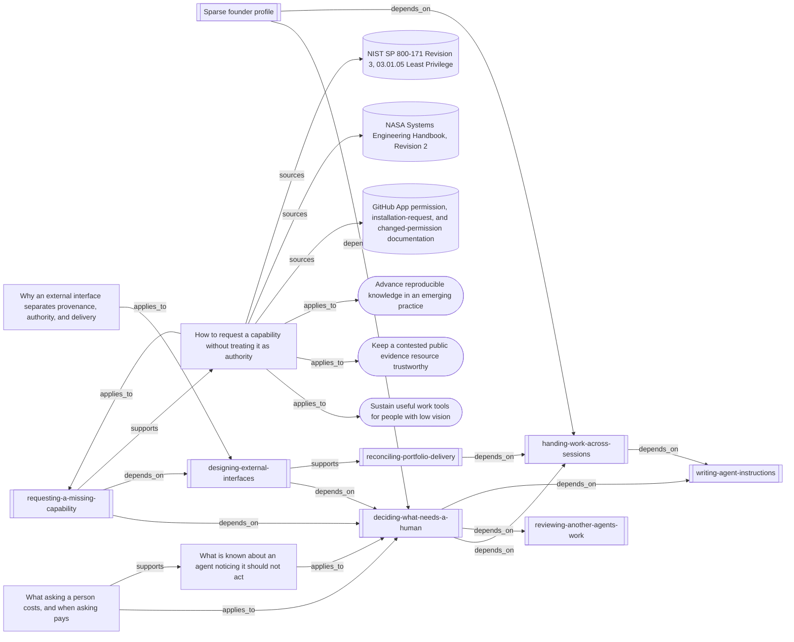

# What authority-safe capability requests rest on

The map connects the operative skill to its evidence, adjacent authority and
interface guidance, and mission transfers. It does not establish effectiveness.

<!-- generated by tools/build-views.mjs: everything below is derived from the records -->

## What is in this view

### Missions

- [Sustain useful work tools for people with low vision](../missions/accessible-work-tools.md), `mission:accessible-work-tools`
- [Keep a contested public evidence resource trustworthy](../missions/public-evidence-ledger.md), `mission:public-evidence-ledger`
- [Advance reproducible knowledge in an emerging practice](../missions/reproducible-practice.md), `mission:reproducible-practice`

### Founder context

- [Sparse founder profile](../founder/PROFILE.md), `founder:PROFILE`

### Skills

- [deciding-what-needs-a-human](../skills/deciding-what-needs-a-human/SKILL.md), `skill:deciding-what-needs-a-human`
- [designing-external-interfaces](../skills/designing-external-interfaces/SKILL.md), `skill:designing-external-interfaces`
- [handing-work-across-sessions](../skills/handing-work-across-sessions/SKILL.md), `skill:handing-work-across-sessions`
- [reconciling-portfolio-delivery](../skills/reconciling-portfolio-delivery/SKILL.md), `skill:reconciling-portfolio-delivery`
- [requesting-a-missing-capability](../skills/requesting-a-missing-capability/SKILL.md), `skill:requesting-a-missing-capability`
- [reviewing-another-agents-work](../skills/reviewing-another-agents-work/SKILL.md), `skill:reviewing-another-agents-work`
- [writing-agent-instructions](../skills/writing-agent-instructions/SKILL.md), `skill:writing-agent-instructions`

### Knowledge

- [How to request a capability without treating it as authority](../knowledge/authority-safe-capability-requests.md), `knowledge:authority-safe-capability-requests`
- [Why an external interface separates provenance, authority, and delivery](../knowledge/designing-external-interface-boundaries.md), `knowledge:designing-external-interface-boundaries`
- [What is known about an agent noticing it should not act](../knowledge/recognising-the-authority-boundary.md), `knowledge:recognising-the-authority-boundary`
- [What asking a person costs, and when asking pays](../knowledge/what-asking-a-human-costs.md), `knowledge:what-asking-a-human-costs`

### Evidence

- [GitHub App permission, installation-request, and changed-permission documentation](../evidence/github-app-capability-requests-2026-09-11.md), `evidence:github-app-capability-requests-2026-09-11`
- [NASA Systems Engineering Handbook, Revision 2](../evidence/nasa-capability-requirements-2026-09-11.md), `evidence:nasa-capability-requirements-2026-09-11`
- [NIST SP 800-171 Revision 3, 03.01.05 Least Privilege](../evidence/nist-least-privilege-2026-09-11.md), `evidence:nist-least-privilege-2026-09-11`
