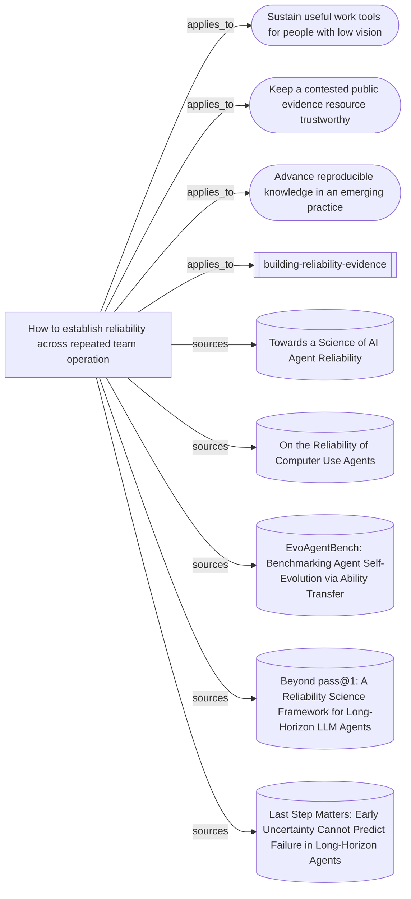

# What the repeated-operation reliability skill rests on

The entrypoint, supporting synthesis, three mission transfers and five source
readings. No node is a behavioural case: this is a source and reasoning map, not
evidence that the skill makes a continuing team more reliable.

Everything below the marker is produced by `node tools/build-views.mjs`.

<!-- generated by tools/build-views.mjs: everything below is derived from the records -->

## What is in this view

### Missions

- [Sustain useful work tools for people with low vision](../missions/accessible-work-tools.md), `mission:accessible-work-tools`
- [Keep a contested public evidence resource trustworthy](../missions/public-evidence-ledger.md), `mission:public-evidence-ledger`
- [Advance reproducible knowledge in an emerging practice](../missions/reproducible-practice.md), `mission:reproducible-practice`

### Skills

- [building-reliability-evidence](../skills/building-reliability-evidence/SKILL.md), `skill:building-reliability-evidence`

### Knowledge

- [How to establish reliability across repeated team operation](../knowledge/establishing-reliability-across-repeated-operation.md), `knowledge:establishing-reliability-across-repeated-operation`

### Evidence

- [Towards a Science of AI Agent Reliability](../evidence/agent-reliability-framework-2026-09-10.md), `evidence:agent-reliability-framework-2026-09-10`
- [On the Reliability of Computer Use Agents](../evidence/computer-use-reliability-2026-09-10.md), `evidence:computer-use-reliability-2026-09-10`
- [EvoAgentBench: Benchmarking Agent Self-Evolution via Ability Transfer](../evidence/evoagentbench-transfer-2026-09-10.md), `evidence:evoagentbench-transfer-2026-09-10`
- [Beyond pass@1: A Reliability Science Framework for Long-Horizon LLM Agents](../evidence/long-horizon-reliability-gds-2026-09-10.md), `evidence:long-horizon-reliability-gds-2026-09-10`
- [Last Step Matters: Early Uncertainty Cannot Predict Failure in Long-Horizon Agents](../evidence/mid-run-confidence-2026-09-09.md), `evidence:mid-run-confidence-2026-09-09`
