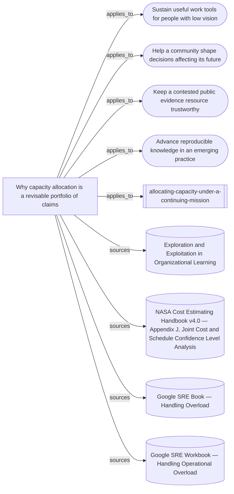

# What capacity allocation under a continuing mission rests on

The entrypoint, supporting synthesis, four mission transfers and four source
readings. This is a source and reasoning map, not evidence that the skill
improves allocation decisions.

Everything below the marker is produced by `node tools/build-views.mjs`.

<!-- generated by tools/build-views.mjs: everything below is derived from the records -->

## What is in this view

### Missions

- [Sustain useful work tools for people with low vision](../missions/accessible-work-tools.md), `mission:accessible-work-tools`
- [Help a community shape decisions affecting its future](../missions/community-decision-watch.md), `mission:community-decision-watch`
- [Keep a contested public evidence resource trustworthy](../missions/public-evidence-ledger.md), `mission:public-evidence-ledger`
- [Advance reproducible knowledge in an emerging practice](../missions/reproducible-practice.md), `mission:reproducible-practice`

### Skills

- [allocating-capacity-under-a-continuing-mission](../skills/allocating-capacity-under-a-continuing-mission/SKILL.md), `skill:allocating-capacity-under-a-continuing-mission`

### Knowledge

- [Why capacity allocation is a revisable portfolio of claims](../knowledge/allocating-capacity-under-a-continuing-mission.md), `knowledge:allocating-capacity-under-a-continuing-mission`

### Evidence

- [Exploration and Exploitation in Organizational Learning](../evidence/march-exploration-exploitation-2026-09-11.md), `evidence:march-exploration-exploitation-2026-09-11`
- [NASA Cost Estimating Handbook v4.0 — Appendix J, Joint Cost and Schedule Confidence Level Analysis](../evidence/nasa-joint-cost-schedule-confidence-2026-09-11.md), `evidence:nasa-joint-cost-schedule-confidence-2026-09-11`
- [Google SRE Book — Handling Overload](../evidence/sre-handling-overload-2026-09-11.md), `evidence:sre-handling-overload-2026-09-11`
- [Google SRE Workbook — Handling Operational Overload](../evidence/sre-operational-overload-2026-09-11.md), `evidence:sre-operational-overload-2026-09-11`
