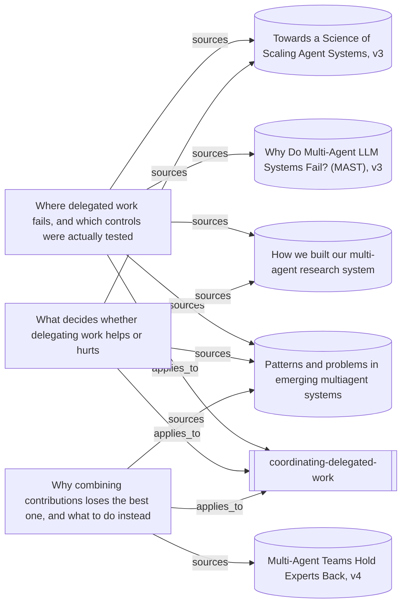

# What the delegation skill rests on

The delegation entrypoint, the three knowledge entries that carry its
measurements and conditions, and the five source readings those entries cite.
The shape is the point: every consequential recommendation in the skill reaches
a preserved reading of a named source in two steps, and nothing in this map is
a behavioural case — no run has tested whether the guidance changes what a
leader does.

One edge is deliberately not followed. The skill also records `depends_on` the
instruction-authoring entrypoint, because it sends a leader there to compose
the briefs it asks for rather than restating that method; walking it would pull
that skill's whole basis into a map about this one. Its own view draws it.

Everything below the marker is produced by `node tools/build-views.mjs`.

<!-- generated by tools/build-views.mjs: everything below is derived from the records -->

## What is in this view

### Skills

- [coordinating-delegated-work](../skills/coordinating-delegated-work/SKILL.md), `skill:coordinating-delegated-work`

### Knowledge

- [Where delegated work fails, and which controls were actually tested](../knowledge/coordination-failure-controls.md), `knowledge:coordination-failure-controls`
- [What decides whether delegating work helps or hurts](../knowledge/delegation-decision-basis.md), `knowledge:delegation-decision-basis`
- [Why combining contributions loses the best one, and what to do instead](../knowledge/integrating-delegated-contributions.md), `knowledge:integrating-delegated-contributions`

### Evidence

- [Why Do Multi-Agent LLM Systems Fail? (MAST), v3](../evidence/mast-failures-2026-09-09.md), `evidence:mast-failures-2026-09-09`
- [How we built our multi-agent research system](../evidence/multi-agent-research-system-2026-09-09.md), `evidence:multi-agent-research-system-2026-09-09`
- [Patterns and problems in emerging multiagent systems](../evidence/multiagent-patterns-problems-2026-09-09.md), `evidence:multiagent-patterns-problems-2026-09-09`
- [Towards a Science of Scaling Agent Systems, v3](../evidence/scaling-agent-systems-2026-09-09.md), `evidence:scaling-agent-systems-2026-09-09`
- [Multi-Agent Teams Hold Experts Back, v4](../evidence/teams-hold-experts-back-2026-09-09.md), `evidence:teams-hold-experts-back-2026-09-09`
