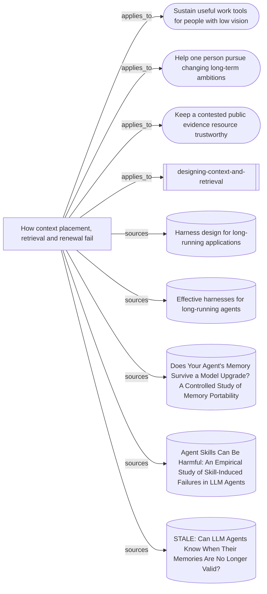

# What the context-and-retrieval skill rests on

The entrypoint, its supporting synthesis, three mission transfers and five source
readings. No node is a behavioural case: this is a source and reasoning map, not
evidence that the skill improves a continuing role.

Everything below the marker is produced by `node tools/build-views.mjs`.

<!-- generated by tools/build-views.mjs: everything below is derived from the records -->

## What is in this view

### Missions

- [Sustain useful work tools for people with low vision](../missions/accessible-work-tools.md), `mission:accessible-work-tools`
- [Help one person pursue changing long-term ambitions](../missions/adaptive-ambition-support.md), `mission:adaptive-ambition-support`
- [Keep a contested public evidence resource trustworthy](../missions/public-evidence-ledger.md), `mission:public-evidence-ledger`

### Skills

- [designing-context-and-retrieval](../skills/designing-context-and-retrieval/SKILL.md), `skill:designing-context-and-retrieval`

### Knowledge

- [How context placement, retrieval and renewal fail](../knowledge/placing-and-renewing-agent-context.md), `knowledge:placing-and-renewing-agent-context`

### Evidence

- [Harness design for long-running applications](../evidence/harness-design-long-running-apps-2026-09-09.md), `evidence:harness-design-long-running-apps-2026-09-09`
- [Effective harnesses for long-running agents](../evidence/long-running-harnesses-2026-09-09.md), `evidence:long-running-harnesses-2026-09-09`
- [Does Your Agent's Memory Survive a Model Upgrade? A Controlled Study of Memory Portability](../evidence/memory-portability-2026-09-09.md), `evidence:memory-portability-2026-09-09`
- [Agent Skills Can Be Harmful: An Empirical Study of Skill-Induced Failures in LLM Agents](../evidence/skill-induced-failures-2026-09-10.md), `evidence:skill-induced-failures-2026-09-10`
- [STALE: Can LLM Agents Know When Their Memories Are No Longer Valid?](../evidence/stale-memory-validity-2026-09-09.md), `evidence:stale-memory-validity-2026-09-09`
