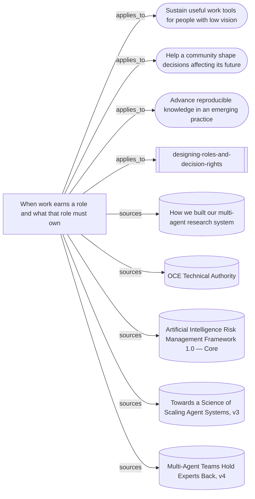

# What the role-design skill rests on

The entrypoint, its supporting synthesis, three mission transfers and the five
source readings behind them. No node is a behavioural case: this is a source and
reasoning map, not evidence that the skill changes a leader's decisions.

Everything below the marker is produced by `node tools/build-views.mjs`.

<!-- generated by tools/build-views.mjs: everything below is derived from the records -->

## What is in this view

### Missions

- [Sustain useful work tools for people with low vision](../missions/accessible-work-tools.md), `mission:accessible-work-tools`
- [Help a community shape decisions affecting its future](../missions/community-decision-watch.md), `mission:community-decision-watch`
- [Advance reproducible knowledge in an emerging practice](../missions/reproducible-practice.md), `mission:reproducible-practice`

### Skills

- [designing-roles-and-decision-rights](../skills/designing-roles-and-decision-rights/SKILL.md), `skill:designing-roles-and-decision-rights`

### Knowledge

- [When work earns a role and what that role must own](../knowledge/shaping-roles-and-decision-rights.md), `knowledge:shaping-roles-and-decision-rights`

### Evidence

- [How we built our multi-agent research system](../evidence/multi-agent-research-system-2026-09-09.md), `evidence:multi-agent-research-system-2026-09-09`
- [OCE Technical Authority](../evidence/nasa-technical-authority-2026-09-10.md), `evidence:nasa-technical-authority-2026-09-10`
- [Artificial Intelligence Risk Management Framework 1.0 — Core](../evidence/nist-ai-rmf-roles-2026-09-10.md), `evidence:nist-ai-rmf-roles-2026-09-10`
- [Towards a Science of Scaling Agent Systems, v3](../evidence/scaling-agent-systems-2026-09-09.md), `evidence:scaling-agent-systems-2026-09-09`
- [Multi-Agent Teams Hold Experts Back, v4](../evidence/teams-hold-experts-back-2026-09-09.md), `evidence:teams-hold-experts-back-2026-09-09`
