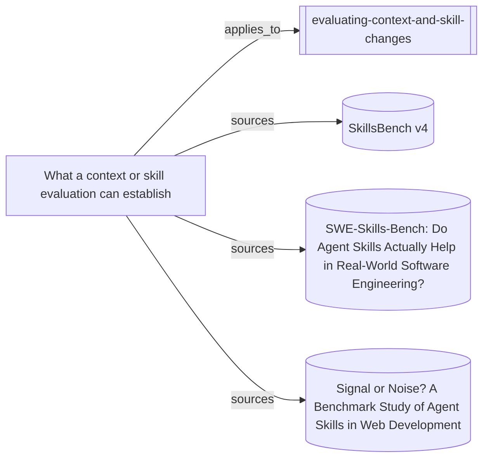

# What the context-and-skill evaluation method rests on

The entrypoint, its supporting synthesis, and the three direct skill studies.
This map is evidence for the method's basis, not proof that the skill improves
downstream work.

Everything below the marker is produced by `node tools/build-views.mjs`.

<!-- generated by tools/build-views.mjs: everything below is derived from the records -->

## What is in this view

### Skills

- [evaluating-context-and-skill-changes](../skills/evaluating-context-and-skill-changes/SKILL.md), `skill:evaluating-context-and-skill-changes`

### Knowledge

- [What a context or skill evaluation can establish](../knowledge/evaluating-context-and-skill-changes.md), `knowledge:evaluating-context-and-skill-changes`

### Evidence

- [SkillsBench v4](../evidence/skillsbench-authoring-2026-09-09.md), `evidence:skillsbench-authoring-2026-09-09`
- [SWE-Skills-Bench: Do Agent Skills Actually Help in Real-World Software Engineering?](../evidence/swe-skills-bench-2026-09-10.md), `evidence:swe-skills-bench-2026-09-10`
- [Signal or Noise? A Benchmark Study of Agent Skills in Web Development](../evidence/webdev-skills-signal-noise-2026-09-10.md), `evidence:webdev-skills-signal-noise-2026-09-10`
