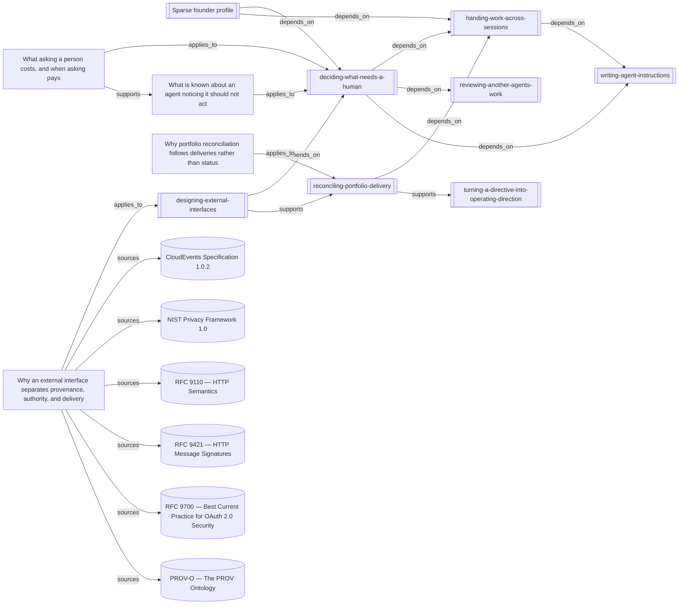

# External interface provenance, authority, and delivery

This view connects the operative interface method to its supporting synthesis,
neighboring decisions, and primary-source readings.

<!-- generated by tools/build-views.mjs: everything below is derived from the records -->

## What is in this view

### Founder context

- [Sparse founder profile](../founder/PROFILE.md), `founder:PROFILE`

### Skills

- [deciding-what-needs-a-human](../skills/deciding-what-needs-a-human/SKILL.md), `skill:deciding-what-needs-a-human`
- [designing-external-interfaces](../skills/designing-external-interfaces/SKILL.md), `skill:designing-external-interfaces`
- [handing-work-across-sessions](../skills/handing-work-across-sessions/SKILL.md), `skill:handing-work-across-sessions`
- [reconciling-portfolio-delivery](../skills/reconciling-portfolio-delivery/SKILL.md), `skill:reconciling-portfolio-delivery`
- [reviewing-another-agents-work](../skills/reviewing-another-agents-work/SKILL.md), `skill:reviewing-another-agents-work`
- [turning-a-directive-into-operating-direction](../skills/turning-a-directive-into-operating-direction/SKILL.md), `skill:turning-a-directive-into-operating-direction`
- [writing-agent-instructions](../skills/writing-agent-instructions/SKILL.md), `skill:writing-agent-instructions`

### Knowledge

- [Why an external interface separates provenance, authority, and delivery](../knowledge/designing-external-interface-boundaries.md), `knowledge:designing-external-interface-boundaries`
- [What is known about an agent noticing it should not act](../knowledge/recognising-the-authority-boundary.md), `knowledge:recognising-the-authority-boundary`
- [Why portfolio reconciliation follows deliveries rather than status](../knowledge/reconciling-portfolio-delivery.md), `knowledge:reconciling-portfolio-delivery`
- [What asking a person costs, and when asking pays](../knowledge/what-asking-a-human-costs.md), `knowledge:what-asking-a-human-costs`

### Evidence

- [CloudEvents Specification 1.0.2](../evidence/cloudevents-1-0-2-2026-09-11.md), `evidence:cloudevents-1-0-2-2026-09-11`
- [NIST Privacy Framework 1.0](../evidence/nist-privacy-framework-2026-09-11.md), `evidence:nist-privacy-framework-2026-09-11`
- [RFC 9110 — HTTP Semantics](../evidence/rfc-9110-http-acceptance-2026-09-11.md), `evidence:rfc-9110-http-acceptance-2026-09-11`
- [RFC 9421 — HTTP Message Signatures](../evidence/rfc-9421-message-signatures-2026-09-11.md), `evidence:rfc-9421-message-signatures-2026-09-11`
- [RFC 9700 — Best Current Practice for OAuth 2.0 Security](../evidence/rfc-9700-oauth-security-2026-09-11.md), `evidence:rfc-9700-oauth-security-2026-09-11`
- [PROV-O — The PROV Ontology](../evidence/w3c-prov-2026-09-11.md), `evidence:w3c-prov-2026-09-11`
