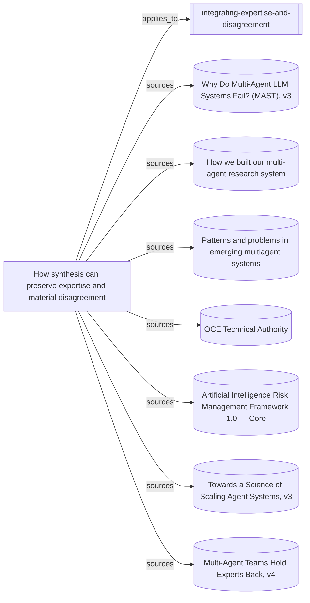

# What the expertise-and-disagreement skill rests on

The entrypoint, its supporting synthesis and the seven readings behind it.
The map separates empirical observations and governance precedents from the
combined operating method, whose effectiveness has not been tested. Its
`depends_on` relationship to the narrower delegated-contribution synthesis is
not followed, avoiding a duplicate evidence branch.

Everything below the marker is produced by `node tools/build-views.mjs`.

<!-- generated by tools/build-views.mjs: everything below is derived from the records -->

## What is in this view

### Skills

- [integrating-expertise-and-disagreement](../skills/integrating-expertise-and-disagreement/SKILL.md), `skill:integrating-expertise-and-disagreement`

### Knowledge

- [How synthesis can preserve expertise and material disagreement](../knowledge/integrating-expertise-and-disagreement.md), `knowledge:integrating-expertise-and-disagreement`

### Evidence

- [Why Do Multi-Agent LLM Systems Fail? (MAST), v3](../evidence/mast-failures-2026-09-09.md), `evidence:mast-failures-2026-09-09`
- [How we built our multi-agent research system](../evidence/multi-agent-research-system-2026-09-09.md), `evidence:multi-agent-research-system-2026-09-09`
- [Patterns and problems in emerging multiagent systems](../evidence/multiagent-patterns-problems-2026-09-09.md), `evidence:multiagent-patterns-problems-2026-09-09`
- [OCE Technical Authority](../evidence/nasa-technical-authority-2026-09-10.md), `evidence:nasa-technical-authority-2026-09-10`
- [Artificial Intelligence Risk Management Framework 1.0 — Core](../evidence/nist-ai-rmf-roles-2026-09-10.md), `evidence:nist-ai-rmf-roles-2026-09-10`
- [Towards a Science of Scaling Agent Systems, v3](../evidence/scaling-agent-systems-2026-09-09.md), `evidence:scaling-agent-systems-2026-09-09`
- [Multi-Agent Teams Hold Experts Back, v4](../evidence/teams-hold-experts-back-2026-09-09.md), `evidence:teams-hold-experts-back-2026-09-09`
