# How mission progress assessment hangs together

The assessment lens applies across the sample missions. The worked transfer
shows how one existing selection finding changes a concrete decision in the
accessible-work-tools mission while keeping its transfer limits visible.

```mermaid
flowchart LR
  mission_accessible_work_tools(["Sustain useful work tools for people with low vision"])
  mission_adaptive_ambition_support(["Help one person pursue changing long-term ambitions"])
  mission_community_decision_watch(["Help a community shape decisions affecting its future"])
  mission_public_evidence_ledger(["Keep a contested public evidence resource trustworthy"])
  mission_reproducible_practice(["Advance reproducible knowledge in an emerging practice"])
  founder_first_run[["Sparse founder first-run context"]]
  founder_PROFILE[["Sparse founder profile"]]
  knowledge_assessing_progress_under_a_continuing_mission["How to assess progress under a continuing mission"]
  knowledge_choosing_an_accessible_work_increment["Worked transfer — choose the next accessible-work increment"]
  knowledge_choosing_work_under_a_directive["What is known about an agent choosing its own next work"]
  knowledge_establishing_operating_direction["What an operating direction must make testable"]
  knowledge_establishing_reliability_across_repeated_operation["How to establish reliability across repeated team operation"]
  knowledge_mission_difficulty_basis_2026_09_10["Why the sample missions were estimated just beyond the public frontier"]
  knowledge_placing_and_renewing_agent_context["How context placement, retrieval and renewal fail"]
  knowledge_shaping_roles_and_decision_rights["When work earns a role and what that role must own"]
  evidence_goal_drift_trading_2026_09_09[("Technical Report: Evaluating Goal Drift in Language Model Agents")]
  evidence_goal_selection_divergence_2026_09_09[("Language Model Goal Selection Differs from Humans' in a Self-Directed Learning Task")]
  evidence_mission_assessment_agent_process_2026_09_10[("Beyond Final Scores: A Systematic Evaluation of Agents for Long-Horizon AI Research and Development")]
  evidence_mission_assessment_magenta_book_2026_09_10[("Magenta Book: Central Government guidance on evaluation")]
  evidence_mission_assessment_oecd_criteria_2026_09_10[("Applying Evaluation Criteria Thoughtfully")]
  evidence_mission_assessment_venture_experimentation_2026_09_10[("Financing Entrepreneurial Experimentation")]

  founder_first_run -->|applies_to| mission_accessible_work_tools
  founder_first_run -->|depends_on| founder_PROFILE
  founder_first_run -->|depends_on| knowledge_assessing_progress_under_a_continuing_mission
  knowledge_assessing_progress_under_a_continuing_mission -->|applies_to| mission_accessible_work_tools
  knowledge_assessing_progress_under_a_continuing_mission -->|applies_to| mission_adaptive_ambition_support
  knowledge_assessing_progress_under_a_continuing_mission -->|applies_to| mission_community_decision_watch
  knowledge_assessing_progress_under_a_continuing_mission -->|applies_to| mission_public_evidence_ledger
  knowledge_assessing_progress_under_a_continuing_mission -->|applies_to| mission_reproducible_practice
  knowledge_assessing_progress_under_a_continuing_mission -->|sources| evidence_mission_assessment_agent_process_2026_09_10
  knowledge_assessing_progress_under_a_continuing_mission -->|sources| evidence_mission_assessment_magenta_book_2026_09_10
  knowledge_assessing_progress_under_a_continuing_mission -->|sources| evidence_mission_assessment_oecd_criteria_2026_09_10
  knowledge_assessing_progress_under_a_continuing_mission -->|sources| evidence_mission_assessment_venture_experimentation_2026_09_10
  knowledge_choosing_an_accessible_work_increment -->|applies_to| mission_accessible_work_tools
  knowledge_choosing_an_accessible_work_increment -->|supports| knowledge_assessing_progress_under_a_continuing_mission
  knowledge_choosing_an_accessible_work_increment -->|depends_on| knowledge_choosing_work_under_a_directive
  knowledge_choosing_an_accessible_work_increment -->|sources| evidence_goal_drift_trading_2026_09_09
  knowledge_choosing_an_accessible_work_increment -->|sources| evidence_goal_selection_divergence_2026_09_09
  knowledge_choosing_work_under_a_directive -->|sources| evidence_goal_drift_trading_2026_09_09
  knowledge_choosing_work_under_a_directive -->|sources| evidence_goal_selection_divergence_2026_09_09
  knowledge_establishing_operating_direction -->|applies_to| mission_accessible_work_tools
  knowledge_establishing_operating_direction -->|applies_to| mission_community_decision_watch
  knowledge_establishing_operating_direction -->|sources| evidence_mission_assessment_magenta_book_2026_09_10
  knowledge_establishing_reliability_across_repeated_operation -->|applies_to| mission_accessible_work_tools
  knowledge_establishing_reliability_across_repeated_operation -->|applies_to| mission_public_evidence_ledger
  knowledge_establishing_reliability_across_repeated_operation -->|applies_to| mission_reproducible_practice
  knowledge_mission_difficulty_basis_2026_09_10 -->|applies_to| mission_accessible_work_tools
  knowledge_mission_difficulty_basis_2026_09_10 -->|applies_to| mission_adaptive_ambition_support
  knowledge_mission_difficulty_basis_2026_09_10 -->|applies_to| mission_community_decision_watch
  knowledge_mission_difficulty_basis_2026_09_10 -->|applies_to| mission_public_evidence_ledger
  knowledge_mission_difficulty_basis_2026_09_10 -->|applies_to| mission_reproducible_practice
  knowledge_placing_and_renewing_agent_context -->|applies_to| mission_accessible_work_tools
  knowledge_placing_and_renewing_agent_context -->|applies_to| mission_adaptive_ambition_support
  knowledge_placing_and_renewing_agent_context -->|applies_to| mission_public_evidence_ledger
  knowledge_shaping_roles_and_decision_rights -->|applies_to| mission_accessible_work_tools
  knowledge_shaping_roles_and_decision_rights -->|applies_to| mission_community_decision_watch
  knowledge_shaping_roles_and_decision_rights -->|applies_to| mission_reproducible_practice
```

<!-- generated by tools/build-views.mjs: everything below is derived from the records -->

## What is in this view

### Missions

- [Sustain useful work tools for people with low vision](../missions/accessible-work-tools.md), `mission:accessible-work-tools`
- [Help one person pursue changing long-term ambitions](../missions/adaptive-ambition-support.md), `mission:adaptive-ambition-support`
- [Help a community shape decisions affecting its future](../missions/community-decision-watch.md), `mission:community-decision-watch`
- [Keep a contested public evidence resource trustworthy](../missions/public-evidence-ledger.md), `mission:public-evidence-ledger`
- [Advance reproducible knowledge in an emerging practice](../missions/reproducible-practice.md), `mission:reproducible-practice`

### Founder context

- [Sparse founder first-run context](../founder/first-run.md), `founder:first-run`
- [Sparse founder profile](../founder/PROFILE.md), `founder:PROFILE`

### Knowledge

- [How to assess progress under a continuing mission](../knowledge/assessing-progress-under-a-continuing-mission.md), `knowledge:assessing-progress-under-a-continuing-mission`
- [Worked transfer — choose the next accessible-work increment](../knowledge/choosing-an-accessible-work-increment.md), `knowledge:choosing-an-accessible-work-increment`
- [What is known about an agent choosing its own next work](../knowledge/choosing-work-under-a-directive.md), `knowledge:choosing-work-under-a-directive`
- [What an operating direction must make testable](../knowledge/establishing-operating-direction.md), `knowledge:establishing-operating-direction`
- [How to establish reliability across repeated team operation](../knowledge/establishing-reliability-across-repeated-operation.md), `knowledge:establishing-reliability-across-repeated-operation`
- [Why the sample missions were estimated just beyond the public frontier](../knowledge/mission-difficulty-basis-2026-09-10.md), `knowledge:mission-difficulty-basis-2026-09-10`
- [How context placement, retrieval and renewal fail](../knowledge/placing-and-renewing-agent-context.md), `knowledge:placing-and-renewing-agent-context`
- [When work earns a role and what that role must own](../knowledge/shaping-roles-and-decision-rights.md), `knowledge:shaping-roles-and-decision-rights`

### Evidence

- [Technical Report: Evaluating Goal Drift in Language Model Agents](../evidence/goal-drift-trading-2026-09-09.md), `evidence:goal-drift-trading-2026-09-09`
- [Language Model Goal Selection Differs from Humans' in a Self-Directed Learning Task](../evidence/goal-selection-divergence-2026-09-09.md), `evidence:goal-selection-divergence-2026-09-09`
- [Beyond Final Scores: A Systematic Evaluation of Agents for Long-Horizon AI Research and Development](../evidence/mission-assessment-agent-process-2026-09-10.md), `evidence:mission-assessment-agent-process-2026-09-10`
- [Magenta Book: Central Government guidance on evaluation](../evidence/mission-assessment-magenta-book-2026-09-10.md), `evidence:mission-assessment-magenta-book-2026-09-10`
- [Applying Evaluation Criteria Thoughtfully](../evidence/mission-assessment-oecd-criteria-2026-09-10.md), `evidence:mission-assessment-oecd-criteria-2026-09-10`
- [Financing Entrepreneurial Experimentation](../evidence/mission-assessment-venture-experimentation-2026-09-10.md), `evidence:mission-assessment-venture-experimentation-2026-09-10`
