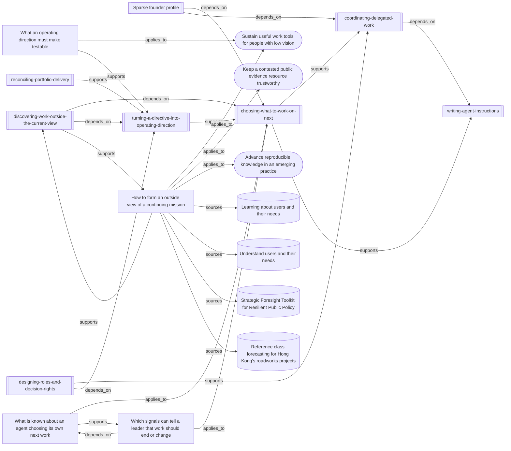

# How outside-view discovery hangs together

The method widens a continuing team's strategic option set before ordinary
work selection. The map connects its instructions to the evidence, adjacent
skills, and mission transfers that expose different forms of omission.

<!-- generated by tools/build-views.mjs: everything below is derived from the records -->

## What is in this view

### Missions

- [Sustain useful work tools for people with low vision](../missions/accessible-work-tools.md), `mission:accessible-work-tools`
- [Keep a contested public evidence resource trustworthy](../missions/public-evidence-ledger.md), `mission:public-evidence-ledger`
- [Advance reproducible knowledge in an emerging practice](../missions/reproducible-practice.md), `mission:reproducible-practice`

### Founder context

- [Sparse founder profile](../founder/PROFILE.md), `founder:PROFILE`

### Skills

- [choosing-what-to-work-on-next](../skills/choosing-what-to-work-on-next/SKILL.md), `skill:choosing-what-to-work-on-next`
- [coordinating-delegated-work](../skills/coordinating-delegated-work/SKILL.md), `skill:coordinating-delegated-work`
- [designing-roles-and-decision-rights](../skills/designing-roles-and-decision-rights/SKILL.md), `skill:designing-roles-and-decision-rights`
- [discovering-work-outside-the-current-view](../skills/discovering-work-outside-the-current-view/SKILL.md), `skill:discovering-work-outside-the-current-view`
- [reconciling-portfolio-delivery](../skills/reconciling-portfolio-delivery/SKILL.md), `skill:reconciling-portfolio-delivery`
- [turning-a-directive-into-operating-direction](../skills/turning-a-directive-into-operating-direction/SKILL.md), `skill:turning-a-directive-into-operating-direction`
- [writing-agent-instructions](../skills/writing-agent-instructions/SKILL.md), `skill:writing-agent-instructions`

### Knowledge

- [What is known about an agent choosing its own next work](../knowledge/choosing-work-under-a-directive.md), `knowledge:choosing-work-under-a-directive`
- [What an operating direction must make testable](../knowledge/establishing-operating-direction.md), `knowledge:establishing-operating-direction`
- [How to form an outside view of a continuing mission](../knowledge/forming-an-outside-view.md), `knowledge:forming-an-outside-view`
- [Which signals can tell a leader that work should end or change](../knowledge/retiring-and-redirecting-work.md), `knowledge:retiring-and-redirecting-work`

### Evidence

- [Learning about users and their needs](../evidence/gds-learning-user-needs-2026-09-11.md), `evidence:gds-learning-user-needs-2026-09-11`
- [Understand users and their needs](../evidence/gds-understand-user-needs-2026-09-11.md), `evidence:gds-understand-user-needs-2026-09-11`
- [Strategic Foresight Toolkit for Resilient Public Policy](../evidence/oecd-strategic-foresight-toolkit-2026-09-11.md), `evidence:oecd-strategic-foresight-toolkit-2026-09-11`
- [Reference class forecasting for Hong Kong's roadworks projects](../evidence/reference-class-hong-kong-roadworks-2026-09-11.md), `evidence:reference-class-hong-kong-roadworks-2026-09-11`
