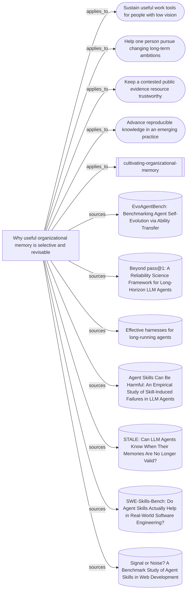

# What selective organizational-memory guidance rests on

This view connects the entrypoint, supporting synthesis, mission transfers, and
source readings. It maps evidence and reasoning, not proof that the resulting
skill improves a continuing team.

Everything below the marker is produced by `node tools/build-views.mjs`.

<!-- generated by tools/build-views.mjs: everything below is derived from the records -->

## What is in this view

### Missions

- [Sustain useful work tools for people with low vision](../missions/accessible-work-tools.md), `mission:accessible-work-tools`
- [Help one person pursue changing long-term ambitions](../missions/adaptive-ambition-support.md), `mission:adaptive-ambition-support`
- [Keep a contested public evidence resource trustworthy](../missions/public-evidence-ledger.md), `mission:public-evidence-ledger`
- [Advance reproducible knowledge in an emerging practice](../missions/reproducible-practice.md), `mission:reproducible-practice`

### Skills

- [cultivating-organizational-memory](../skills/cultivating-organizational-memory/SKILL.md), `skill:cultivating-organizational-memory`

### Knowledge

- [Why useful organizational memory is selective and revisable](../knowledge/selective-organizational-memory.md), `knowledge:selective-organizational-memory`

### Evidence

- [EvoAgentBench: Benchmarking Agent Self-Evolution via Ability Transfer](../evidence/evoagentbench-transfer-2026-09-10.md), `evidence:evoagentbench-transfer-2026-09-10`
- [Beyond pass@1: A Reliability Science Framework for Long-Horizon LLM Agents](../evidence/long-horizon-reliability-gds-2026-09-10.md), `evidence:long-horizon-reliability-gds-2026-09-10`
- [Effective harnesses for long-running agents](../evidence/long-running-harnesses-2026-09-09.md), `evidence:long-running-harnesses-2026-09-09`
- [Agent Skills Can Be Harmful: An Empirical Study of Skill-Induced Failures in LLM Agents](../evidence/skill-induced-failures-2026-09-10.md), `evidence:skill-induced-failures-2026-09-10`
- [STALE: Can LLM Agents Know When Their Memories Are No Longer Valid?](../evidence/stale-memory-validity-2026-09-09.md), `evidence:stale-memory-validity-2026-09-09`
- [SWE-Skills-Bench: Do Agent Skills Actually Help in Real-World Software Engineering?](../evidence/swe-skills-bench-2026-09-10.md), `evidence:swe-skills-bench-2026-09-10`
- [Signal or Noise? A Benchmark Study of Agent Skills in Web Development](../evidence/webdev-skills-signal-noise-2026-09-10.md), `evidence:webdev-skills-signal-noise-2026-09-10`
