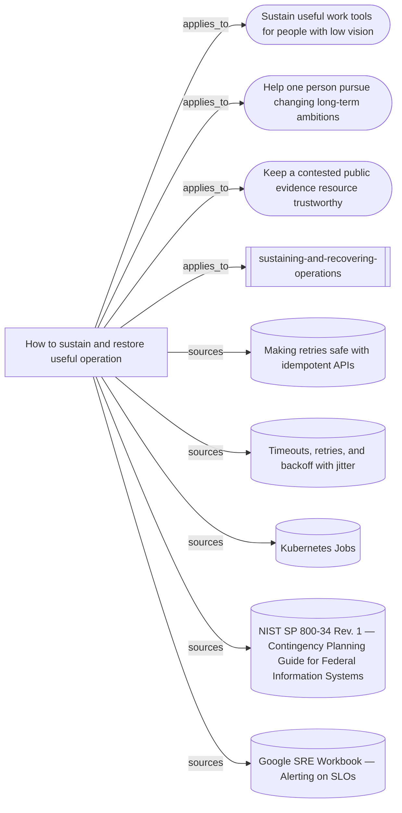

# What the operational continuity and recovery skill rests on

The entrypoint, supporting synthesis, three mission transfers and five source
readings. No node is a behavioural case: this is a source and reasoning map, not
evidence that the skill improves a continuing team's recovery.

Everything below the marker is produced by `node tools/build-views.mjs`.

<!-- generated by tools/build-views.mjs: everything below is derived from the records -->

## What is in this view

### Missions

- [Sustain useful work tools for people with low vision](../missions/accessible-work-tools.md), `mission:accessible-work-tools`
- [Help one person pursue changing long-term ambitions](../missions/adaptive-ambition-support.md), `mission:adaptive-ambition-support`
- [Keep a contested public evidence resource trustworthy](../missions/public-evidence-ledger.md), `mission:public-evidence-ledger`

### Skills

- [sustaining-and-recovering-operations](../skills/sustaining-and-recovering-operations/SKILL.md), `skill:sustaining-and-recovering-operations`

### Knowledge

- [How to sustain and restore useful operation](../knowledge/sustaining-and-restoring-useful-operation.md), `knowledge:sustaining-and-restoring-useful-operation`

### Evidence

- [Making retries safe with idempotent APIs](../evidence/aws-idempotent-retries-2026-09-10.md), `evidence:aws-idempotent-retries-2026-09-10`
- [Timeouts, retries, and backoff with jitter](../evidence/aws-retries-backoff-2026-09-10.md), `evidence:aws-retries-backoff-2026-09-10`
- [Kubernetes Jobs](../evidence/kubernetes-jobs-2026-09-10.md), `evidence:kubernetes-jobs-2026-09-10`
- [NIST SP 800-34 Rev. 1 — Contingency Planning Guide for Federal Information Systems](../evidence/nist-contingency-planning-2026-09-10.md), `evidence:nist-contingency-planning-2026-09-10`
- [Google SRE Workbook — Alerting on SLOs](../evidence/sre-alerting-on-slos-2026-09-10.md), `evidence:sre-alerting-on-slos-2026-09-10`
