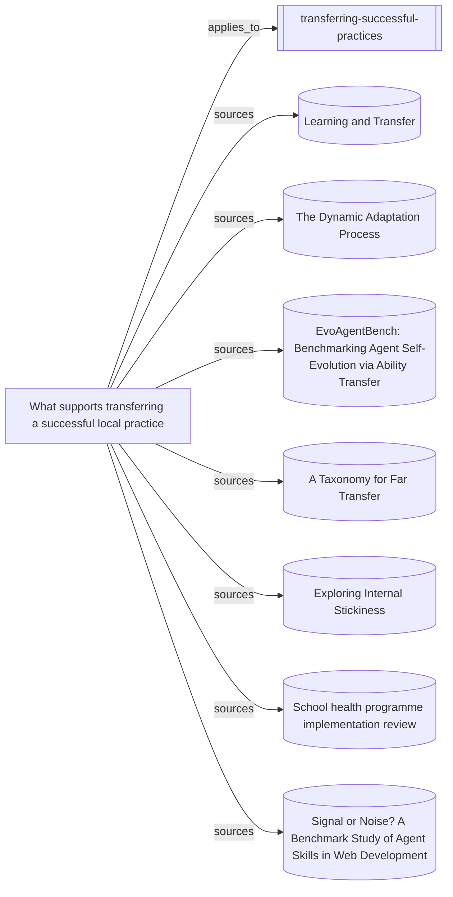

# What the successful-practice transfer skill rests on

The entrypoint, supporting synthesis, human transfer and implementation
research, and contrary agent evidence. This is a source map, not evidence that
the combined skill improves a continuing team.

Everything below the marker is produced by `node tools/build-views.mjs`.

<!-- generated by tools/build-views.mjs: everything below is derived from the records -->

## What is in this view

### Skills

- [transferring-successful-practices](../skills/transferring-successful-practices/SKILL.md), `skill:transferring-successful-practices`

### Knowledge

- [What supports transferring a successful local practice](../knowledge/transferring-successful-local-practices.md), `knowledge:transferring-successful-local-practices`

### Evidence

- [Learning and Transfer](../evidence/analogical-encoding-transfer-2026-09-11.md), `evidence:analogical-encoding-transfer-2026-09-11`
- [The Dynamic Adaptation Process](../evidence/dynamic-adaptation-process-2026-09-11.md), `evidence:dynamic-adaptation-process-2026-09-11`
- [EvoAgentBench: Benchmarking Agent Self-Evolution via Ability Transfer](../evidence/evoagentbench-transfer-2026-09-10.md), `evidence:evoagentbench-transfer-2026-09-10`
- [A Taxonomy for Far Transfer](../evidence/far-transfer-taxonomy-2026-09-11.md), `evidence:far-transfer-taxonomy-2026-09-11`
- [Exploring Internal Stickiness](../evidence/internal-stickiness-2026-09-11.md), `evidence:internal-stickiness-2026-09-11`
- [School health programme implementation review](../evidence/school-health-implementation-2026-09-11.md), `evidence:school-health-implementation-2026-09-11`
- [Signal or Noise? A Benchmark Study of Agent Skills in Web Development](../evidence/webdev-skills-signal-noise-2026-09-10.md), `evidence:webdev-skills-signal-noise-2026-09-10`
