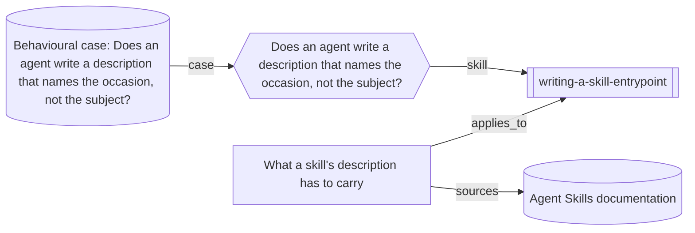

# How the worked example hangs together

One entrypoint, the knowledge entry that supports it, the case it is run
against, and the two records they rest on. It is the smallest map this
collection can draw, and it exists to show that a view is generated from the
same typed relations the checks resolve, rather than drawn by hand beside
them.

The frontmatter above is the whole definition: where to start, and how many
steps of relationship to follow. Everything below the marker is produced by
`node tools/build-views.mjs` and reverted by it if edited. See
[LAYOUT.md](../LAYOUT.md) for what a view may say and why the nodes are not
themselves links.

<!-- generated by tools/build-views.mjs: everything below is derived from the records -->

## What is in this view

### Skills

- [writing-a-skill-entrypoint](../skills/writing-a-skill-entrypoint/SKILL.md), `skill:writing-a-skill-entrypoint`

### Knowledge

- [What a skill's description has to carry](../knowledge/skill-entrypoint-description.md), `knowledge:skill-entrypoint-description`

### Cases

- [Does an agent write a description that names the occasion, not the subject?](../cases/skill-description-trigger.md), `case:skill-description-trigger`

### Evidence

- [Agent Skills documentation](../evidence/agent-skills-docs-2026-09-08.md), `evidence:agent-skills-docs-2026-09-08`
- [Behavioural case: Does an agent write a description that names the occasion, not the subject?](../evidence/run-skill-description-trigger-2026-09-09.md), `evidence:run-skill-description-trigger-2026-09-09`
